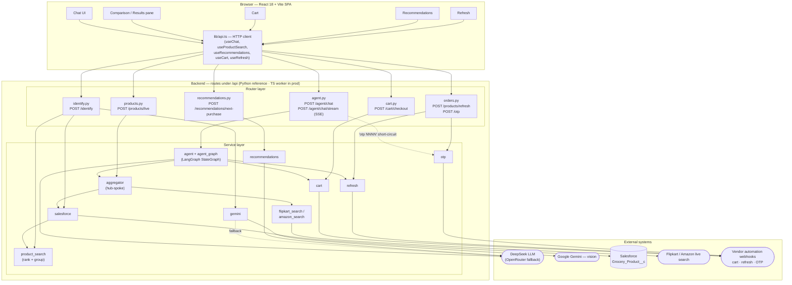

# Architecture — Price Compare

High-level view of how a request flows from the browser, through the backend's
router and service layers, out to the external systems the app integrates with.
All searching happens inside the LangGraph agent (`/api/agent/chat[/stream]`);
the only other product endpoint is the phase-2 `/api/products/live` fetch.

## External systems

| System | Used by | Purpose |
| --- | --- | --- |
| **DeepSeek** (OpenRouter fallback) | `agent`, `cart` (name resolution), `gemini` (fallback) | Chat completions + tool calling for the agent loop |
| **Google Gemini** (`generativelanguage.googleapis.com`) | `gemini` | Identify products from an uploaded image |
| **Salesforce** (OAuth client-credentials + SOQL) | `salesforce` | Catalog of past purchases — `Grocery_Product__c` |
| **Flipkart / Amazon live search** (`SEARCH_PRODUCT_*_URL`) | `flipkart_search`, `amazon_search` | Live store rows for sources the catalog didn't cover |
| **Vendor automation webhooks** | `cart`, `refresh`, `otp` | Cart checkout, order refresh, OTP submission |

## Deployment

The app deploys to **Cloudflare Workers** (`worker/` — Hono + `@langchain/langgraph`,
TypeScript): same `/api/*` contract, SPA served as Workers static assets. Live at
`https://price-compare.nit4infy1.workers.dev`.

Workers can't run the Python app (V8 isolates — no `uvicorn` / native
`pydantic-core`/`orjson`/langgraph wheels), so `worker/` is a TypeScript
reimplementation with behavioral parity. It bundles to ~490 KiB gzipped. Cross-turn
agent state is KV-backed there (no in-process checkpointer on ephemeral isolates).
The Python `backend/` remains the reference implementation and local-dev server;
it is not deployed.

## Notes

- In local dev the Vite dev server proxies `/api/*` to the backend (`:8000` for
  the Python app, or run `worker && pnpm dev` to serve API + built SPA on `:8787`).
- The `otp <number>` path in `agent.py` is handled deterministically **before**
  the LLM, so the model never sees or invents OTP codes.
- `product_search` is pure ranking/grouping logic — it has no external calls; it
  shapes Salesforce (and image-identify) records into the response.
