# Architecture — Price Compare

High-level view of how a request flows from the browser, through the FastAPI
backend's router and service layers, out to the external systems the app
integrates with.

> Note: this diagram reflects the **live codebase** (7 routers / 11 services),
> which has grown beyond the single chat→search loop described in `CLAUDE.md`.

```mermaid
flowchart TD
    subgraph Browser["Browser — React 18 + Vite SPA"]
        UI_Chat["Chat UI"]
        UI_Results["Comparison / Results pane"]
        UI_Cart["Cart"]
        UI_Recs["Recommendations"]
        UI_Refresh["Refresh"]
        API["lib/api.ts — HTTP client<br/>(useChat, useProductSearch,<br/>useRecommendations, useCart, useRefresh)"]
        UI_Chat --> API
        UI_Results --> API
        UI_Cart --> API
        UI_Recs --> API
        UI_Refresh --> API
    end

    subgraph Backend["FastAPI backend — backend/app (routes under /api)"]
        direction TB
        subgraph Routers["Router layer"]
            R_chat["chat.py<br/>POST /chat"]
            R_agent["agent.py<br/>POST /agent/chat"]
            R_identify["identify.py<br/>POST /identify"]
            R_products["products.py<br/>POST /products/search<br/>POST /products/search/flipkart"]
            R_recs["recommendations.py<br/>POST /recommendations/next-purchase"]
            R_cart["cart.py<br/>POST /cart/checkout"]
            R_orders["orders.py<br/>POST /products/refresh<br/>POST /otp"]
        end
        subgraph Services["Service layer"]
            S_openrouter["openrouter"]
            S_agent["agent"]
            S_gemini["gemini"]
            S_salesforce["salesforce"]
            S_psearch["product_search<br/>(rank + group)"]
            S_flipkart["flipkart_search"]
            S_recs["recommendations"]
            S_cart["cart"]
            S_refresh["refresh"]
            S_otp["otp"]
        end
    end

    subgraph External["External systems"]
        X_OR(["OpenRouter LLM"])
        X_Gem(["Google Gemini — vision"])
        X_SF[("Salesforce<br/>Grocery_Product__c")]
        X_FK(["Flipkart live search"])
        X_Vendor(["Vendor automation webhooks<br/>cart · refresh · OTP"])
    end

    %% Browser -> routers
    API --> R_chat
    API --> R_agent
    API --> R_identify
    API --> R_products
    API --> R_recs
    API --> R_cart
    API --> R_orders

    %% chat: deterministic "otp <number>" short-circuit before the LLM
    R_chat -.->|"'otp NNNN' short-circuit"| S_otp
    R_chat --> S_openrouter

    %% agent
    R_agent --> S_agent
    R_agent -.->|otp short-circuit| S_otp
    S_agent --> S_salesforce

    %% identify (image)
    R_identify --> S_gemini
    R_identify --> S_salesforce
    R_identify --> S_psearch

    %% catalog search + flipkart fallback
    R_products --> S_salesforce
    S_salesforce --> S_psearch
    R_products -.->|catalog empty → fallback| S_flipkart

    %% recommendations / cart / orders
    R_recs --> S_recs
    R_cart --> S_cart
    R_orders --> S_refresh
    R_orders --> S_otp

    %% services -> external
    S_openrouter --> X_OR
    S_agent --> X_OR
    S_gemini --> X_Gem
    S_gemini -.->|fallback| X_OR
    S_recs --> X_OR
    S_salesforce --> X_SF
    S_flipkart --> X_FK
    S_cart --> X_Vendor
    S_refresh --> X_Vendor
    S_otp --> X_Vendor
```

## External systems

| System | Used by | Purpose |
| --- | --- | --- |
| **OpenRouter** (`/api/v1/chat/completions`) | `openrouter`, `agent`, `recommendations`, `gemini` (fallback) | Chat completions + tool calling |
| **Google Gemini** (`generativelanguage.googleapis.com`) | `gemini` | Identify products from an uploaded image |
| **Salesforce** (OAuth client-credentials + SOQL) | `salesforce` | Catalog of past purchases — `Grocery_Product__c` |
| **Flipkart live search** (`search_product_flipkart_url`) | `flipkart_search` | Live results when the catalog search is empty |
| **Vendor automation webhooks** | `cart`, `refresh`, `otp` | Cart checkout, order refresh, OTP submission |

## Notes

- In Docker, FastAPI also serves the built SPA from `dist/` (see `main.py`); in
  local dev the Vite dev server proxies `/api/*` to the backend.
- The `otp <number>` path in `chat.py` is handled deterministically **before**
  the LLM, so the model never sees or invents OTP codes.
- `product_search` is pure ranking/grouping logic — it has no external calls; it
  shapes Salesforce (and image-identify) records into the response.
